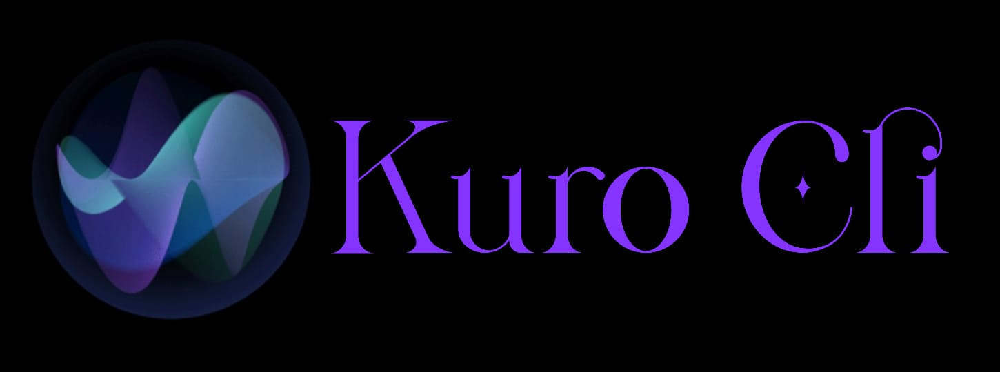

# Kuro-CLI 🎙️

<div align="center">
  
  
  <h3>Voice-Controlled Terminal Assistant</h3>
  
  <p>
    <strong>Transform your terminal experience with AI-powered voice commands</strong>
  </p>
  
  <p>
    <a href="https://github.com/Sukumarsawant/Kuro-CLI-">
      
    </a>
    <a href="#usage">
      
    </a>
    <a href="#contributing">
      
    </a>
  </p>
</div>

---

## ✨ Features

- 🎤 **Voice Recognition** - Speak naturally to control your terminal
- 🧠 **AI-Powered** - Leverages Google's Gemini AI for intelligent command interpretation
- ⚡ **Instant Execution** - Converts speech to terminal commands in real-time
- 🔧 **Coding Assistant** - Specialized for development tasks and workflows
- 🌐 **Cross-Platform** - Works on Windows, macOS, and Linux

---

## 🚀 Quick Start

### Prerequisites

Before you begin, ensure you have the following installed:

- **Python 3.8+** 
- **Microphone** (for voice input)
- **Google Gemini API Key** ([Get yours here](https://makersuite.google.com/app/apikey))

### Installation

1. **Clone the repository**
   ```bash
   git clone https://github.com/Sukumarsawant/Kuro-CLI-.git
   cd Kuro-CLI-
   ```

2. **Install dependencies**
   ```bash
   pip install -r requirements.txt
   ```

3. **Set up environment variables**
   
   Create a `.env` file in the project root:
   ```env
   GEMINI_API_KEY=your_api_key_here
   ```

4. **Launch Kuro**
   ```bash
   python main.py
   ```

---

## 💬 Usage Examples

Once Kuro is running, try these voice commands:

### 🖥️ Application Control
- *"Open Notepad"*
- *"Launch Visual Studio Code"*
- *"Start Chrome and search for Python tutorials"*

### 📁 File Operations
- *"Create a new folder called projects"*
- *"List all files in the current directory"*
- *"Delete the temporary files"*

### 🔧 Development Tasks
- *"Initialize a new Git repository"*
- *"Install numpy using pip"*
- *"Run the Python script"*

### 🛑 Exit Commands
- *"Exit"* | *"Quit"* | *"Stop"*

---

## 🛠️ Built With

<div align="center">
  
  
  
</div>

### Core Technologies

- **[Python](https://python.org)** - Main programming language
- **[Google Generative AI (Gemini)](https://ai.google.dev)** - AI model for command interpretation
- **[SpeechRecognition](https://pypi.org/project/SpeechRecognition/)** - Voice-to-text conversion
- **[Python-dotenv](https://pypi.org/project/python-dotenv/)** - Environment variable management

---

## 🤝 Contributing

We welcome contributions! Here's how you can help improve Kuro-CLI:

### How to Contribute

1. **Fork the repository**
   ```bash
   git fork https://github.com/Sukumarsawant/Kuro-CLI-
   ```

2. **Create a feature branch**
   ```bash
   git checkout -b feature/amazing-feature
   ```

3. **Make your changes**
   - Add your improvements
   - Test thoroughly
   - Update documentation if needed

4. **Commit your changes**
   ```bash
   git commit -m "✨ Add amazing feature"
   ```

5. **Push to your branch**
   ```bash
   git push origin feature/amazing-feature
   ```

6. **Open a Pull Request**

### 💡 Ideas for Contributions

- Add support for more languages
- Implement custom command shortcuts
- Create a GUI interface
- Add command history and favorites
- Improve error handling and user feedback

---

## 📋 Roadmap

- [ ] Multi-language support
- [ ] Custom voice commands
- [ ] Integration with more AI models
- [ ] Web interface
- [ ] Command history and analytics
- [ ] Plugin system

---

## 🙏 Acknowledgments

Special thanks to the amazing open-source community and these resources:

- **[SpeechRecognition Library](https://pypi.org/project/SpeechRecognition/)** - For reliable voice recognition
- **[Google Gemini AI](https://ai.google.dev)** - For powerful AI capabilities
- **[Best README Template](https://github.com/othneildrew/Best-README-Template)** - For README inspiration
- **[Python-dotenv](https://pypi.org/project/python-dotenv/)** - For environment management

---

## 📄 License

This project is licensed under the MIT License - see the [LICENSE](LICENSE) file for details.

---

## 🌟 Support

If you find this project helpful, please consider:

- ⭐ **Star this repository**
- 🐛 **Report bugs** in the [Issues](https://github.com/Sukumarsawant/Kuro-CLI-/issues) section
- 💬 **Share your feedback** and suggestions
- 🔄 **Share with others** who might find it useful

---

<div align="center">
  <p>Made with ❤️ by <a href="https://github.com/Sukumarsawant">Sukumar Sawant</a></p>
  <p>
    
    
  </p>
</div>
